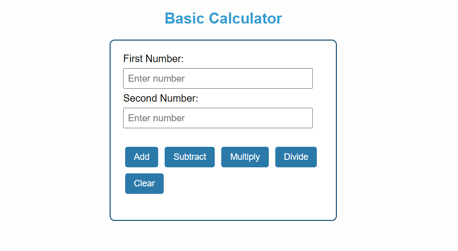

# Basic Calculator

A simple calculator built using **HTML**, **CSS**, and **JavaScript** as a school project.

## Preview

## Features
- Addition, Subtraction, Multiplication, Division
- Input validation (empty fields, divide by zero)
- Clean and simple UI

## How to Use
1. Clone the project from GitHub
2. Open `index.html` in your browser
3. Enter two numbers and click any operation button

## Demo
Live demo: [Click here](https://basic-calculator-pi-ashy.vercel.app/)

## Built With
- HTML
- CSS
- JavaScript

## Author
Made by elitepunith